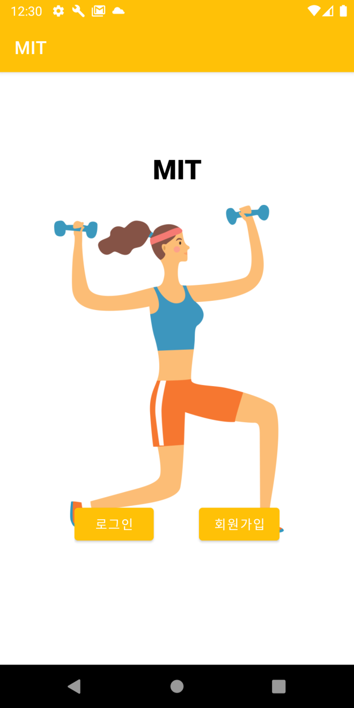
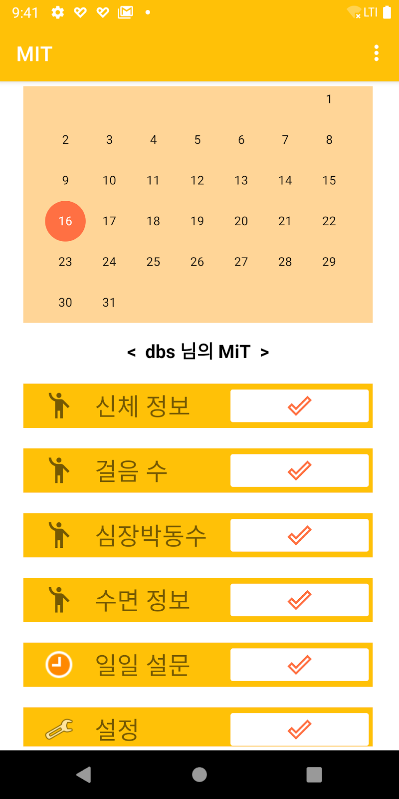

# MiT Application ver2
\[사용언어 : 코틀린\]
## version 1과 차이점 및 보완해야하는 점
* 차이점 : 사용자 1명에 받아와야하는 데이터 정보 숨김, 버그 수정 등)
* 보완 : 서버 주소 등 보안

## 소개

* 목적
    * 코로나와 같은 전염성 질환은 잠복기가 있으며 무증상 감염자 또한 존재합니다. 하지만 잠복기 동안이나 경미한 증상을 보이는 경우에는 본인이 보균자인지 인지하지 못하는 문제점이 발생합니다. 따라서 증상을 기반으로 하는 진단 시스템은 본인도 모르는 사이에 코로나에 감염되고 다른 사람에게 전파시켜 전파 속도를 가속화시키는 원인이 됩니다.
     실시간으로 생체정보에 접근할 수 있고 그 정보를 통해 코로나 바이러스의 진단이가능하다면 증상 기반의 의료시스템에서 발생하는 취약점을 완화할 수 있습니다. 현재 스마트워치 사용률이 증가하는 추세이고 스마트워치의 기술 발달로 건강관리에 필요한 다양한 생체정보를 제공받을 수 있습니다. 따라서 스마트워치를 사용하면 실시간으로 생체정보에 접근할 수 있다는 조건을 충족시킬 수 있습니다.
     

## 권장사양
* API 26 : Android 8.0(Oreo)이상

## 구축 시 등록 해야 하는 것
* Firebase console : 프로젝트 추가 후 google-servie.json을 app 수준에 넣어주세요.
* Google Cloud Platform : API 및 서비스 OAuth 2.0 클라이언트 ID .json을 app 수준에 넣어주세요.

> 1. http://developers.google.com/fit/android/get-started 의 지침에 따라 Android 클라이언트를 등록합니다.  
>  2. 클라우드 프로젝트에 Fit API가 활성화되어 있는지 확인하세요.  
>  3. Cloud 프로젝트의 자격 증명을 확인하세요.  
>  4. 자격 증명의 패키지 이름이 샘플과 일치 하는지 확인하세요.  
>  5. 패키지 이름 applicationId이 app/build.gradle파일과 일치 하는지 확인하세요.  
>  6. 서명 인증서 지문이 올바르게 입력되었는지 확인하세요.  
     
## 필요로하는 권한
> 기본적으로 Google Fitness Application이 깔려 있어야 합니다.
* android.permission.FITNESS_BODY_READ
* android.permission.BODY_SENSORS
* android.permission.ACTIVITY_RECOGNITION
* com.google.android.gms.permission.ACTIVITY_RECOGNITION

## 구성
> 현재 아래의 사진과 다르게 사진은 없습니다. (아래의 사진은 저작권이 없는 사진입니다.)
                                           
 애플리케이션 시작 화면 (1)             |  DashBoard (2)
:------------------------------------:|:----------------------------------------:
  | 
로그인, 회원가입                       |  상세정보, 걸음수, 심박수, 수면, 설문, 설정

3. 로그인
4. 회원가입
5. 상세정보
   * 키
   * 몸무게
6. 걸음수
   * 구글 피트니스에서 수집해온 7일간 걸음 수 시각화 및 전송
7. 심박수
   * 구글 피트니스에서 수집해온 일정시간의 심박수 시각화 및 전송
8. 수면
   * 수면 시작시간, 일어난 시간 입력
   * 수면 질 선택(상, 중, 하)
   * 입력 및 선택 값 전송
9. 설문
   * 오늘의 몸상태를 평상시와 비교
   * 오늘 가진 질병 항목 체크
   * 체크 값 전송
10. 설정
    * 설문 알람 시간 설정(ON/OFF)
    * 문의사항(이메일)
    * 로그아웃
    
#### 구성 설명
* PostgreSQL
    * 데이터베이스로 데이터 상호작용
    * 로그인, 회원가입
    * 키, 몸무게
    
* MQTT -> ThingBoard로 자동 전송 후 시각화
    * 실시간으로 주고받아야 하는 데이터 전송
    * 걸음 수, 심박 수
    * 수면시간, 수면 질
    * 설문

> 참고 자료
>> * https://www.youtube.com/watch?v=OLmAZmBSwMo&feature=emb_title
>> * https://github.com/android/fit-samples/tree/master/StepCounterKotlin
>> * https://dongkka.tistory.com/20
>> * https://webnautes.tistory.com/1365
